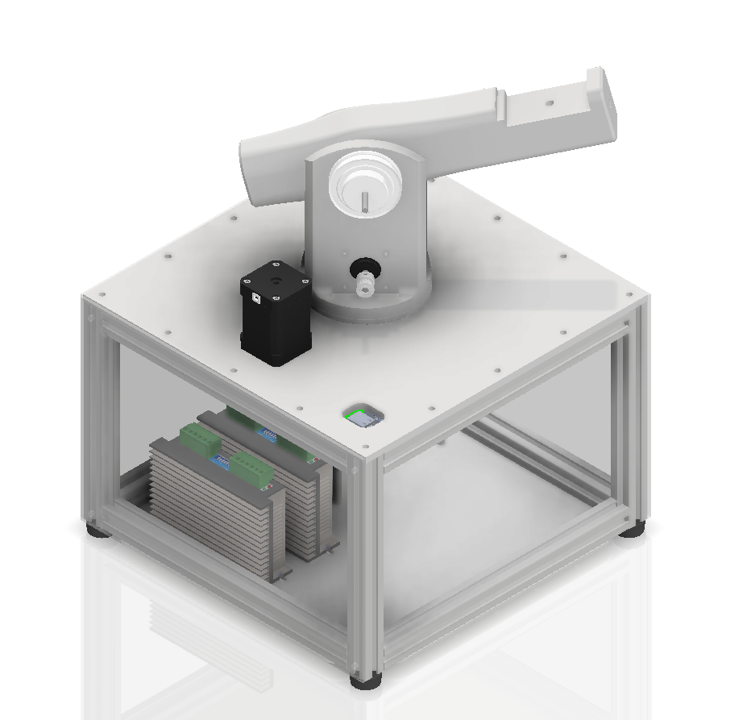
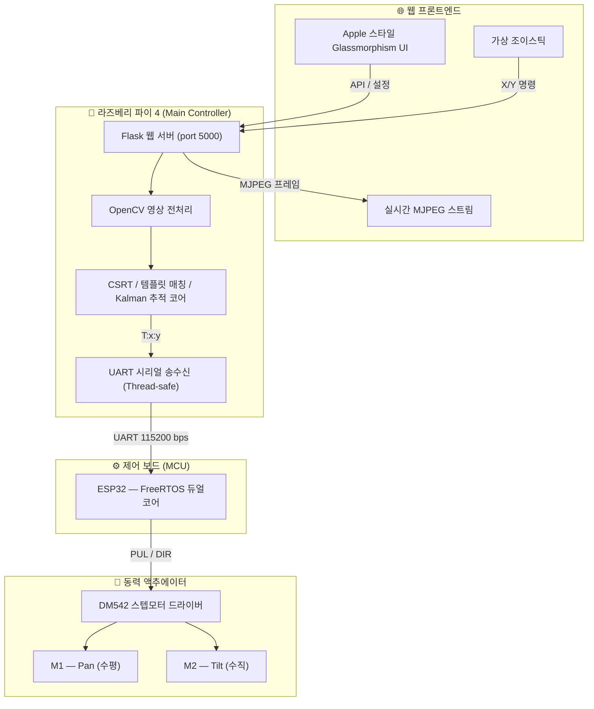
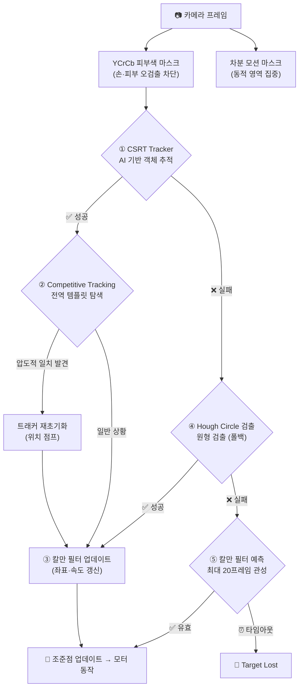

<div align="center">



<br/>


<br/><br/>

> 고성능 객체 인식(CSRT) 알고리즘과 ESP32 스테퍼 모터 정밀 제어를 통해  
> 움직이는 객체를 자동으로 추적하고 모니터링하는 AI 비전 트래커 프로젝트입니다.

<br/>

</div>

---

## ✨ 주요 기능 및 특징 (Features)

### 🖥️ Apple 스타일 Glassmorphic Web UI & UX
- **다이내믹 인터페이스**: 모바일 친화적인 반응형 레이아웃 및 60fps 크로스헤어 애니메이션.
- **직관적인 조작**: 가상 조이스틱(수동 제어), 갤러리 뷰어, 실시간 설정 패널 지원.
- **상태 모니터링**: `LOCKED`, `SEARCHING` 등 실시간 추적 상태 및 모터 연결 상태 시각화.
- **⎋ 전역 세션 탈출**: 학습·드래그 중 언제든 ESC 키로 즉시 안전 복귀 지원.

### 🤖 지능형 객체 추적 알고리즘 (AI Tracking)
- **CSRT 기반 객체 추적**: 드래그 한 번으로 대상을 지정하고 정밀하게 객체의 외형을 학습하여 추적.
- **Competitive Tracking (경쟁적 복구 알고리즘)**: 화면을 벗어났거나 놓친 타겟을 전역 템플릿 매칭을 통해 스스로 다시 찾아내는 스마트 복구 로직.
- **다중 추적 폴백 지원**: 객체 추적 중 발생할 수 있는 노이즈를 대비한 피부색/배경 마스킹 및 원형(Hough Circle) 검출 기능 내장.

### ⚙️ 고성능 하드웨어 제어 (ESP32 & DM542)
- **부드러운 정밀 제어 (S-Curve & P-Control)**: 0 → 3000Hz 속도까지 8.0Hz/ms의 가속도로 부드럽고 강력하게 이동.
- **하드웨어 튜닝 완벽 호환**: 1:5 기어비 (모터 16T / 출력 80T) 등 다양한 물리적 터렛 환경에 대응.
- **실시간 파라미터 동기화**: 웹 UI에서 설정한 가속도, 최대 속도, 픽셀당 이동 거리가 즉각적으로 ESP32 컨트롤러의 타이머 인터럽트에 반영.
- **FOTA(Firmware Over-The-Air)**: 펌웨어 버전 불일치 감지 시 브라우저 상에서 버튼 클릭 한 번으로 ESP32 펌웨어 컴파일 및 업로드 지원 (arduino-cli 연동).

---

## 🏗️ 시스템 아키텍처 (Architecture)

본 프로젝트는 백엔드(AI 연산/서버)와 펌웨어(모터 실시간 제어)가 역할을 분담하여 최상의 퍼포먼스를 발휘합니다.

```text
[ 웹 브라우저 (UI) ] <──(HTTP/API)──> [ Python Flask 서버 (Raspberry Pi/PC) ]
   - 수동 조작 (조이스틱)                - 영상 처리 및 AI 추적 (OpenCV/CSRT)
   - 모터 파라미터 설정                    - P-Control 좌표 연산
   - 실시간 비디오 스트리밍                - 비동기 시리얼 통신 브릿지
                                           │
                                       (Serial/UART)
                                           │
                                   [ ESP32 컨트롤러 ] <──(Pulse/Dir)──> [ DM542 모터 드라이버 ]
                                     - 하드웨어 타이머 제어                - NEMA 스텝 모터 구동
                                     - 정밀 가속도 제어 (accel)            - 1:5 기어비 터렛 물리계
```

### 🔹 아키텍처 데이터 흐름도



---

## 🧠 지능형 추적 알고리즘 파이프라인

단일 알고리즘의 한계를 극복하기 위해 **CSRT, Competitive Tracking, Hough Circle, Kalman Filter**를 융합하여 노이즈와 가림(Occlusion)에 강인한 추적을 실현합니다.



| 알고리즘 | 역할 |
|:---:|:---|
| **YCrCb 스킨 마스크** | `Cr: 133~173 / Cb: 77~127` 범위를 차단해 대상 조작 시 손가락 오검출 방지 |
| **CSRT Tracker** | 객체의 형태를 학습하여 변형과 회전에 강인하게 추적하는 메인 AI 엔진 |
| **Competitive Tracking** | 객체가 시야에서 사라졌다가 다시 나타날 때, 전역 탐색(Template Matching)으로 즉각적인 재포착(Recovery) 수행 |
| **Hough Circle** | 표면 무늬가 없는 대상의 추적 실패 시 특징점 부재를 보완하는 폴백 알고리즘 |
| **Kalman Filter** | 20프레임 관성 예측으로 순간 가림(Occlusion) 발생 시 궤적을 예측하여 추적 유지 |

---

## ⚡ 하드웨어 제어 원리

### ESP32 — FreeRTOS 듀얼코어 병렬 처리

| 코어 | 태스크 | 역할 |
|:---:|:---:|:---|
| **Core 0** | `serialTask` | UART 백그라운드 수신 → 목표 좌표 디코딩 및 파라미터(속도,가속도) 실시간 동기화 |
| **Core 1** | `motorTask` | 10 ms 주기 타이머 → DM542 PUL/DIR 펄스 출력 (최대 3000Hz, 가속도 8.0Hz/ms) |

> 두 태스크는 **Semaphore/Mutex** 로 공유 메모리 충돌을 완전 차단합니다. 1:5 기어비를 바탕으로 부드럽고 강력한 이동을 보장합니다.

### 비례 제어 (P-Control)

$$\text{Steps} = \text{constrain}(|\text{Error}| \times \text{steps/px}, 1, \text{max steps})$$

- **오차 大** → 최대 스텝으로 고속 선회  
- **오차 小** → 1~2 스텝으로 섬세하게 접근 (오버슈트 제거)  
- **데드존 진입** (기본 8 px) → 모터 정지로 미세 떨림·마모 완벽 차단

---

## 📊 MCU 통신 모드 비교

| 항목 | 🟢 ESP32 모드 (메인) | 🔵 Arduino 모드 (레거시/폴백) |
|:---|:---|:---|
| **패킷 포맷** | `T:x:y\n` / `CFG:K:V\n` 텍스트 스트림 | 초경량 JSON 인코딩 |
| **오차 연산 주체** | **ESP32 자체**에서 비례 연산 | **라즈베리 파이**에서 스텝 수 계산 후 전송 |
| **반응성** | 연속 좌표 스트림 → 매끄러운 실시간 트래킹 | 이벤트형 동기 구동 → 정밀 포지셔닝 |
| **추천 용도** | 실시간 물체 추적 · 고속 조이스틱 운용 | 스텝 보정 · 위치 실험 · 센서 캘리브레이션 |

---

## 🔧 하드웨어 구성표

| 부품 | 모델 / 사양 |
|:---|:---|
| **메인 컨트롤러** | Raspberry Pi 4 Model B (또는 일반 PC 환경) |
| **카메라** | USB Web Camera / Raspberry Pi CSI Camera |
| **MCU** | ESP32 (Lolin D32 - FreeRTOS 듀얼코어) / Arduino Uno |
| **모터 드라이버** | DM542 (마이크로스텝 지원 스테퍼 드라이버) |
| **터렛 기어비** | 수평/수직 출력측 80T, 모터측 16T (1 : 5 비율) |
| **동력 모터** | NEMA-17 등급 2축 스텝모터 (Pan / Tilt) |
| **통신 스펙** | UART Serial / 115200 bps |

---

## 📂 프로젝트 파일 구조 (Directory Structure)

```text
📦 AI_vision_tracker
 ┣ 📂 esp32_firmware       # ESP32 C++ 펌웨어 (타이머 인터럽트 기반, OTA 펌웨어 업로드 가능)
 ┣ 📂 static               # 프론트엔드 정적 파일 (script.js, style.css)
 ┣ 📂 templates            # 프론트엔드 HTML (index.html)
 ┣ 📂 learning_data        # 트래커 학습 타겟 이미지 데이터 저장소
 ┣ 📜 main.py              # Flask 서버 진입점 및 스레드 시작
 ┣ 📜 routes.py            # API 엔드포인트 라우팅 (설정, 하드웨어 통신 관리 등)
 ┣ 📜 detector.py          # OpenCV 객체 추적, 경쟁적 탐색 복구 알고리즘 코어
 ┣ 📜 camera.py            # 비디오 스트림 캡처 파이프라인
 ┣ 📜 motor_esp32.py       # ESP32 비동기 시리얼 통신 (Thread-safe, 우선순위 큐 내장)
 ┣ 📜 serial_utils.py      # 운영체제 무관 포트 자동 감지 유틸리티
 ┗ 📜 state.py             # 전역 상태(State) 및 펌웨어 버전 관리
```

---

## 🚀 설치 및 실행 방법 (How to Run)

### 1. 요구 사항 (Prerequisites)
- **Python 3.11+**
- **Arduino CLI** (웹 UI를 통한 원격 펌웨어 업로드 기능 사용 시)
- 연결된 카메라 (USB/CSI)
- ESP32 개발 보드 및 스텝 모터 드라이버(DM542)

### 2. 의존성 패키지 설치
```bash
pip install flask opencv-python opencv-contrib-python numpy pyserial
```
*(CSRT Tracker 구동을 위해 `opencv-contrib-python`이 필수이며, 이 프로젝트는 Pyright 기준 0 Error를 달성하여 완벽한 Type Hinting을 제공합니다.)*

### 3. 서버 실행
```bash
python main.py
```
터미널에 표시되는 로컬 IP 혹은 `http://localhost:5000` 으로 접속합니다.

> [!TIP]
> **물체 학습 및 실시간 추적 가이드**
> 1. 웹 설정 패널에서 **'물건 학습하기'** 모드를 켜고 추적할 대상에 파란색 ROI 박스를 그립니다.
> 2. **학습 시작**을 누르면 AI(CSRT)가 객체의 형태를 초기화하여 부드러운 추적을 시작합니다.
> 3. 카메라 설정 탭에서 터렛의 기어비나 모터 상태에 따라 **steps/px, 최대 속도(Hz), 가속도(Hz/ms)**를 즉시 수정하며 최적의 튜닝값을 찾아보세요.

> [!WARNING]
> **펌웨어 불일치 주의**  
> 시스템 부팅 시 ESP32 보드의 펌웨어 코드가 서버 측 파이썬 환경의 버전(`EXPECTED_FIRMWARE_VERSION`)과 다를 경우 화면에 경고 모달이 뜹니다. 모달의 버튼을 클릭하여 웹에서 즉시 OTA 형식으로 코드를 업로드해 주세요!

---

## 🛠️ 트러블슈팅 및 튜닝 가이드

- **추적이 자꾸 풀리거나 버벅일 경우**: 
  웹 UI의 **'기기 설정'**에서 '조준점 반응 속도'를 줄이거나 대상 객체를 다시 학습시켜주세요. 타겟 주변의 조명이 지나치게 어둡거나 밝으면 인식률이 낮아질 수 있습니다.
- **모터의 속도가 너무 느리거나 과하게 빠른 경우**: 
  웹 UI의 **'모터 튜닝'** 탭에서 **최대 속도(Hz)** 및 **가속도(Hz/ms)** 를 조절하세요. 변경 사항은 즉시 ESP32 인터럽트에 반영됩니다. (DM542 권장 기본값: 3000Hz, 8.0Hz/ms)

---

<div align="center">
  <p><i>본 프로젝트는 서울로봇고등학교 졸업작품의 일환으로 제작되었습니다.</i></p>
  <p>Made with ❤️ by <b>LSK0522</b></p>
</div>
