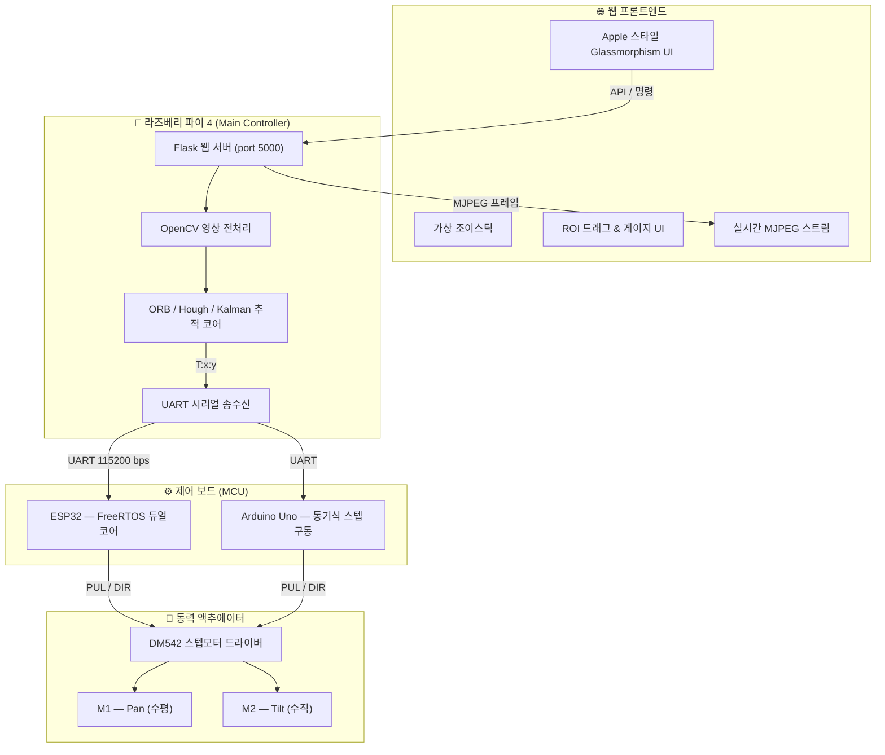
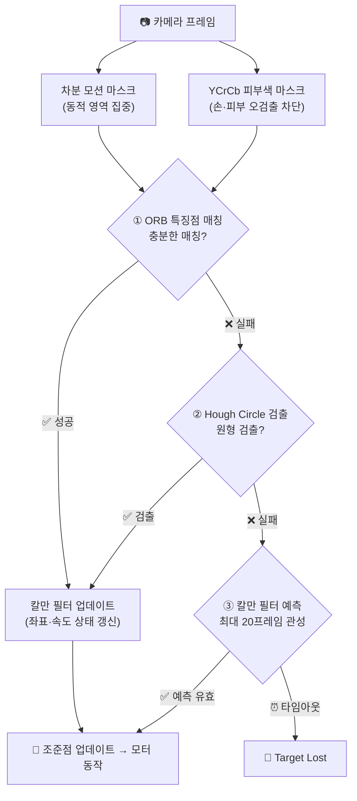

<div align="center">


<br/>


<br/><br/>

> **카메라 비전 인식(OpenCV)** 과 **2축 스텝모터(DM542 드라이버)** 를 결합한  
> 실시간 자동 추적 AI 비전 트래커 시스템 — 졸업작품 프로젝트

<br/>

</div>

---

## 📌 프로젝트 소개

`AI_vision_tracker_ws`는 **라즈베리 파이 4** 위에서 동작하는 AI 기반 비전 트래킹 시스템입니다.  
Flask 웹 서버, OpenCV 비전 파이프라인, UART 시리얼 통신을 하나로 통합하여  
**웹 브라우저 하나만으로 어디서든 카메라를 원격 조종하고, 물체를 자동 추적**할 수 있습니다.

```
웹 UI (조이스틱·클릭)  ─►  Flask 서버  ─►  OpenCV 비전  ─►  UART  ─►  ESP32 / Arduino  ─►  DM542 드라이버  ─►  스텝모터
```

---

## ✨ 주요 기능

<table>
<thead>
<tr>
<th>기능</th>
<th>설명</th>
</tr>
</thead>
<tbody>
<tr>
<td>🕹️ <strong>가상 조이스틱 수동 조종</strong></td>
<td>웹 화면의 조이스틱을 드래그하여 Pan/Tilt 실시간 원격 제어</td>
</tr>
<tr>
<td>🖱️ <strong>클릭 조준</strong></td>
<td>영상 위 임의 지점을 클릭하면 그 방향으로 카메라 자동 정렬</td>
</tr>
<tr>
<td>📦 <strong>ROI 드래그 학습</strong></td>
<td>박스 드래그로 학습 영역 지정 후 물체를 360° 회전시켜 다각도 등록</td>
</tr>
<tr>
<td>🎯 <strong>실시간 자동 추적</strong></td>
<td>ORB 특징점 매칭 → Hough Circle 폴백 → Kalman Filter 관성 예측 파이프라인</td>
</tr>
<tr>
<td>📊 <strong>실시간 파라미터 튜닝</strong></td>
<td>스텝/px, 데드존, 속도 등을 웹 슬라이더로 즉시 적용</td>
</tr>
<tr>
<td>📷 <strong>스냅샷 & 갤러리</strong></td>
<td>셔터 버튼으로 캡처 후 슬라이드 갤러리에서 탐색·다운로드</td>
</tr>
<tr>
<td>⚡ <strong>하드웨어 연결 감지</strong></td>
<td>ESP32 / Arduino 연결 상태를 실시간 인디케이터로 표시·경고</td>
</tr>
<tr>
<td>⎋ <strong>ESC 전역 세션 탈출</strong></td>
<td>학습·드래그 중 언제든 ESC 키로 즉시 안전 복귀</td>
</tr>
</tbody>
</table>

---

## 🏗️ 시스템 아키텍처



---

## 🧠 추적 알고리즘 파이프라인

5개 알고리즘을 단일 파이프라인으로 통합하여 **노이즈와 가림(Occlusion)에 강인한 추적**을 실현합니다.



| 알고리즘 | 역할 |
|:---:|:---|
| **YCrCb 스킨 마스크** | `Cr: 133~173 / Cb: 77~127` 범위를 차단해 손가락 오검출 방지 |
| **차분 모션 필터** | 프레임 간 명암 변화로 정적 배경 노이즈 제거 |
| **ORB + FLANN** | 다각도 학습 descriptor 크로스 매칭으로 타겟 중심 좌표 계산 |
| **Hough Circle** | 표면 무늬가 없는 공(탁구공·당구공) ORB 실패 시 폴백 |
| **Kalman Filter** | 20프레임 관성 예측으로 순간 가림 발생 시 추적 유지 |

---

## ⚡ 하드웨어 제어 원리

### ESP32 — FreeRTOS 듀얼코어 병렬 처리

| 코어 | 태스크 | 역할 |
|:---:|:---:|:---|
| **Core 0** | `serialTask` | UART 백그라운드 수신 → 목표 좌표 디코딩 |
| **Core 1** | `motorTask` | 10 ms 주기 타이머 → DM542 PUL/DIR 펄스 출력 |

> 두 태스크는 **Semaphore/Mutex** 로 공유 메모리 충돌을 완전 차단합니다.

### 비례 제어 (P-Control)

$$\text{Steps} = \text{constrain}\!\left(\,|\text{Error}| \times \text{steps\_per\_px},\ 1,\ \text{max\_steps}\right)$$

- **오차 大** → 최대 스텝으로 고속 선회  
- **오차 小** → 1~2 스텝으로 섬세하게 접근 (오버슈트 제거)  
- **데드존 진입** (기본 8 px) → 모터 정지로 미세 떨림·마모 방지

---

## 📊 MCU 통신 모드 비교

| 항목 | 🟢 ESP32 모드 | 🔵 Arduino 모드 |
|:---|:---|:---|
| **패킷 포맷** | `T:x:y\n` / `CFG:K:V\n` 텍스트 스트림 | 초경량 JSON 인코딩 |
| **오차 연산 주체** | **ESP32 자체**에서 비례 연산 | **라즈베리 파이**에서 스텝 수 계산 후 전송 |
| **반응성** | 연속 좌표 스트림 → 매끄러운 실시간 트래킹 | 이벤트형 동기 구동 → 정밀 포지셔닝 |
| **추천 용도** | 실시간 물체 추적 · 조이스틱 운용 | 스텝 보정 · 위치 실험 · 센서 캘리브레이션 |

---

## 📁 프로젝트 구조

```
AI_vision_tracker_ws/
├── main.py               # Flask 앱 진입점
├── routes.py             # 모든 API 엔드포인트 정의
├── camera.py             # 카메라 캡처 & MJPEG 스트림
├── detector.py           # 비전 추적 파이프라인 (ORB / Hough / Kalman)
├── motor_esp32.py        # ESP32 UART 통신 & 비례 제어
├── motor_arduino.py      # Arduino UART 통신 & 스텝 구동
├── serial_utils.py       # 시리얼 포트 자동 감지 유틸
├── state.py              # 전역 상태 관리
├── capture.py            # 스냅샷 캡처 모듈
├── esp32_firmware/
│   └── esp32_firmware.ino   # ESP32 FreeRTOS 듀얼코어 펌웨어
├── templates/            # Jinja2 HTML 템플릿 (웹 UI)
├── static/               # CSS / JS / 이미지 정적 파일
└── learning_data/        # ORB 학습 데이터 저장소
```

---

## 🚀 실행 방법

### 1. 의존성 설치

```bash
pip install flask opencv-python pyserial numpy
```

### 2. 서버 시작

```bash
# 라즈베리 파이에서 실행
python main.py
```

### 3. 웹 UI 접속

```
http://<라즈베리파이_IP>:5000
```

> [!TIP]
> **물체 학습 가이드**
> 1. 웹 설정 패널에서 **'물건 학습하기'** 모드 활성화
> 2. 마우스로 물체에 딱 맞는 **파란 ROI 박스** 드래그
> 3. **'이 영역 학습 시작'** 클릭 → 4초 타이머 동안 물체를 **천천히 360° 회전**
> 4. **'추가 학습(Add Learning)'** 으로 거리를 바꿔가며 2~3회 반복 → 인식 정밀도 극대화
> 5. **'학습 종료'** 후 **'자동 조종'** 모드로 전환 → 자동 추적 시작

> [!WARNING]
> 학습 중 물체가 너무 가깝거나 어두우면 특징점 0개 경고가 표시됩니다.  
> 조명을 밝게 하거나 물체 거리를 조정한 뒤 **ESC** 로 세션을 초기화하고 재시도하세요.

---

## 🔧 하드웨어 구성

| 부품 | 모델 / 사양 |
|:---|:---|
| **메인 컨트롤러** | Raspberry Pi 4 Model B |
| **카메라** | Raspberry Pi Camera Module |
| **MCU** | ESP32 (FreeRTOS 듀얼코어) / Arduino Uno |
| **모터 드라이버** | DM542 (마이크로스텝 드라이버) |
| **모터** | 2축 스텝모터 (Pan / Tilt) |
| **통신** | UART 115200 bps |

---

## 📄 라이선스

이 프로젝트는 **서울로봇고등학교 졸업작품**으로 제작되었습니다.

---

<div align="center">

Made with ❤️ by **LSK0522** · Seoul Robot High School Graduation Project

</div>
